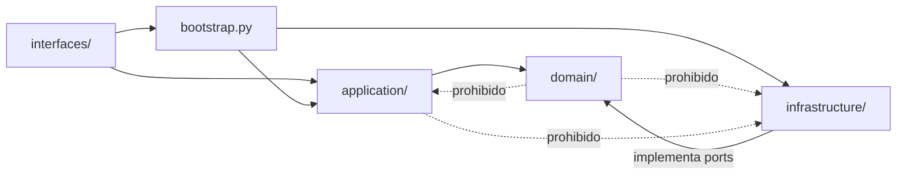
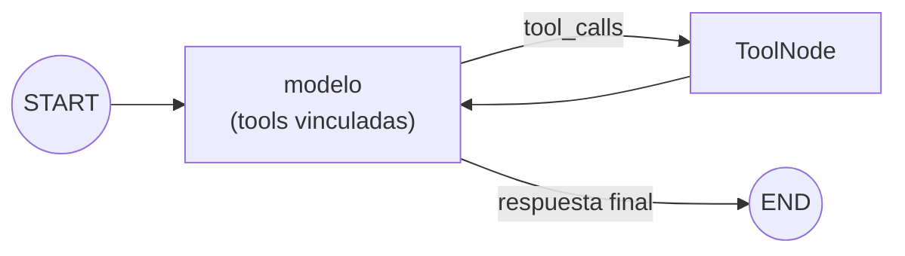
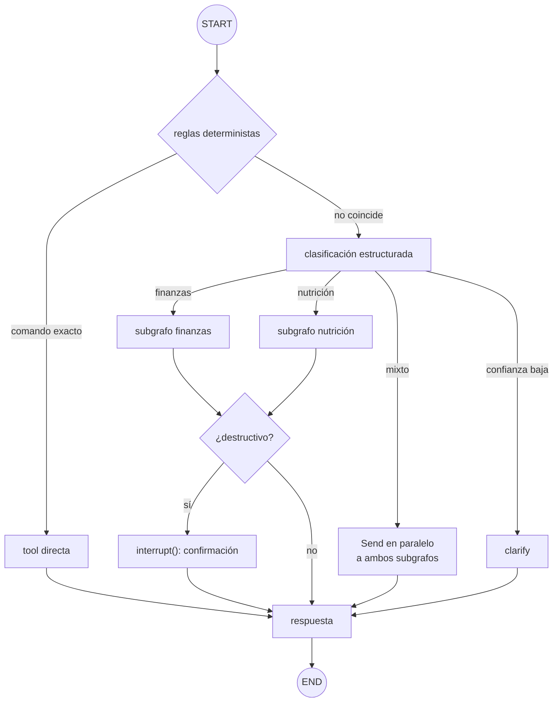

# Arquitectura — Copiloto de finanzas personales y nutrición

**Proyecto:** `finanzas_agent`
**Versión del documento:** 0.1 — propuesta inicial (2026-10-01), previa a cualquier línea de código
**Estado:** aprobada en conversación como dirección general; cada ítem se vuelve a aprobar al implementarse.

**Cómo se relaciona con el resto de `docs/`**

| Documento | Responde a |
| --- | --- |
| `prompt_proyecto_langchain_finanzas_nutricion.md` | ¿Qué se pide construir y con qué reglas de trabajo? |
| Este documento | ¿Cómo se construye y por qué se tomó cada decisión? |
| `plan_fases.md` | ¿En qué orden, con qué ítems, y con qué evidencia de que están hechos? **Fuente de verdad del estado.** |
| *(retirados del repo en `0e18354`)* `arquitectura_solucion.md`, `anexo_arquitectura_objetivo.md` | Referencia histórica del proyecto anterior (`personal_assistant_agent`); consultables en el historial de git (`git show 7972e13:docs/<archivo>`). |

Cuando un componente todavía no existe se marca *(objetivo, Fase N)*. Si algo diverge entre este documento
y `plan_fases.md`, gana `plan_fases.md`.

---

## 1. Propósito y doble objetivo

Un asistente conversacional único que, por lenguaje natural, registra gastos e ingresos, responde sobre el
estado financiero, registra comidas y sugiere qué comer según restricciones y objetivos. Finanzas y nutrición
comparten un asistente y un historial; el diseño debe admitir nuevos dominios sin reescribir los existentes.

El proyecto es **producto y vehículo de aprendizaje** de LangChain y LangGraph. Cuando ambos objetivos
choquen, gana el entendimiento: se prefiere construir una pieza a mano una vez, entenderla, y luego
reemplazarla por la abstracción del framework, a usar la abstracción sin saber qué hace debajo.

## 2. Herencia del proyecto anterior

### 2.1 Lo que se conserva

| Práctica | Por qué |
| --- | --- |
| Dominio puro, sin I/O ni frameworks | Hizo reversibles las decisiones de stack. Aquí además aísla el cálculo financiero/nutricional del LLM. |
| `tenant_id` desde el día uno, inyectado por el servidor, nunca parámetro del LLM | Defensa estructural contra prompt injection. Más crítico con dinero y salud. |
| Integration tests contra Mongo real (contenedor desechable, puerto no estándar, escribir con una instancia y leer con otra) | Única clase de test que detectó los bugs graves del proyecto anterior. |
| Golden dataset + evals opt-in con umbrales en CI | Convierte cambios de prompt/modelo en decisiones medidas. |
| `clarify` como respuesta correcta | Preguntar es mejor que adivinar, especialmente al registrar dinero. |
| Guardrails de ejecución (pasos, tokens, whitelist, confirmación solo en lo destructivo) | El criterio de alcance resultó correcto. |
| `Settings` único con `SecretStr`, `uv` + lockfile, `structlog` con `request_id`, errores saneados, `gitleaks` | Higiene barata con retorno alto. |
| Prompts versionados como ficheros; LLM-as-judge solo offline y calibrado | Trazabilidad y disciplina de coste. |
| Clasificación 🟢/🟡/🔴 con criterio de adopción; hallazgos como ítems propios; DoD con evidencia | Metodología pedida explícitamente por el prompt. |
| Foco: "¿cuántas peticiones pueden resolverse sin LLM?" | Sigue siendo la palanca de coste dominante. |

### 2.2 Lo que salió mal y la lección que deja

| Problema | Lección aplicada aquí |
| --- | --- |
| Pérdida silenciosa de memoria por bridging sync/async y cliente Motor ligado a un loop cerrado | Async de punta a punta desde el primer commit; nunca `asyncio.run` dentro de librerías; test de ida y vuelta por repositorio. |
| Un test escribió en el Atlas productivo | Los tests construyen su conexión con URI explícita; una URI no local en tests falla de forma ruidosa. |
| `requirements.txt` con conflictos nunca detectados | `pyproject.toml` + `uv.lock` desde la Fase 0. |
| MCP por stdio como transporte interno: entorno no heredado, logs en stdout corrompiendo JSON-RPC, cancel scopes de anyio, un subproceso por canal | MCP deja de ser transporte interno (ver D2). Logs siempre a stderr. |
| Router propio que creció por parches de prompt (~590 → ~900 tokens/caso) sin re-evaluar | El control de flujo lo da el grafo; todo cambio de prompt cierra con eval corrido. |
| Confirmación humana inerte (`confirmed=True` forzado) | Confirmación real con `interrupt()`, con test de comportamiento. |
| Tres composition roots independientes | Un único punto de ensamblado desde la Fase 0. |
| Autenticación recién en Fases 6–7 | `Principal` y autenticación en el primer endpoint que muta datos. |
| Observabilidad armada a mano (12 campos) que no cubría la API | Tracing nativo del framework + `structlog` para lo que no es LLM. |
| Deuda por inercia (tests excluidos sin dueño, `mypy` parcial, SDK desactualizado) | `mypy` estricto en todo el repo desde el día uno; un hallazgo sin dueño ni fecha no es un estado válido. |
| Modelo de datos ambiguo (`Task.dates` sin clave fija) | Tipos exactos desde el inicio: `Decimal`, moneda ISO 4217, fechas con zona horaria. |

## 3. Decisiones de arquitectura (ADR)

**D1 — LangGraph como orquestador real, no detrás de un port.**
*Contexto:* el proyecto anterior fijó cuatro criterios para adoptar un state graph y exigía ≥2. Aquí se
cumplen dos desde el inicio: (1) flujos de varios turnos con estado (plan de comidas, conciliar un
presupuesto) y (2) pausar y reanudar con confirmación humana persistida (borrar un movimiento).
*Decisión:* el grafo vive en `application/`; sus nodos invocan servicios de aplicación que operan sobre el
dominio puro. No se envuelve LangGraph en un port propio: aprender el framework es el objetivo y ocultarlo
lo anularía. *Consecuencia:* `application/` depende de LangGraph; `domain/` sigue sin depender de nada.

**D2 — Tools nativas de LangChain en proceso; MCP solo como adaptador de entrada.**
*Decisión:* la lógica vive en servicios de aplicación; cada tool es un envoltorio delgado (`@tool`) que lee
`tenant_id`/`user_id` del contexto de ejecución, invisible para el LLM. Un servidor MCP *(objetivo, Fase 8)*
expone los mismos servicios a clientes externos. *Se conserva:* una implementación por capacidad y tests de
contrato por tool. *Se elimina:* subprocesos stdio en el camino caliente y su fricción.

**D3 — Un agente en la Fase 2; supervisor con subagentes por dominio cuando exista el segundo dominio.**
Desde la Fase 1 se define el **contrato de dominio** (tools + prompt + subgrafo), de modo que añadir un
dominio sea registrar uno más. El supervisor *(objetivo, Fase 7)* conserva el camino barato que funcionó
—reglas deterministas → clasificación estructurada → `clarify`— como nodos y aristas condicionales. La
elección "supervisor vs. agente único" se toma con el eval de la Fase 5, no por preferencia.

**D4 — Memoria con los primitivos de LangGraph.** Corto plazo: checkpointer sobre Mongo, un `thread_id` por
conversación. Largo plazo: store con namespace `(tenant_id, user_id, ...)` y extracción gated por
confianza. Resumen/recorte con las utilidades del framework en lugar de un `ContextBuilder` propio.
Obligatorio: test que escribe con una instancia y lee con otra contra Mongo real.

**D5 — Human-in-the-loop con `interrupt()` + `Command(resume=...)`.** Las operaciones destructivas o
irreversibles pausan el grafo; la confirmación queda persistida en el checkpoint y puede resolverse en otra
petición HTTP. Las escrituras normales no piden confirmación.

**D6 — Exactitud del dominio.** Dinero en `Decimal` (`Decimal128` en Mongo), nunca `float`; moneda explícita;
fechas con zona horaria. **El LLM nunca hace aritmética:** totales, saldos y macros los calculan tools
deterministas. Finanzas y salud son categorías sensibles: TTL de sesiones, derecho al olvido y cifrado por
campo se diseñan desde el inicio y se implementan por fases.

**D7 — Stack.** Python 3.12+, `uv`, `ruff`, `mypy --strict` en todo el repo, Pydantic v2,
`pydantic-settings`, FastAPI, **PyMongo Async API** (Motor está deprecado), `structlog`, `pytest`.
Modelos vía `init_chat_model` (independiente del proveedor) con salida estructurada; el modelo se elige por
benchmark, nunca por ficha. *Verificación pendiente en Fase 0:* compatibilidad de los paquetes de
checkpointer/store de LangGraph para Mongo con el cliente async de PyMongo.

**D8 — Observabilidad y evaluación nativas.** LangSmith para trazas y datasets en desarrollo (camino nativo
del framework; muestra cada nodo, arista y tool call); LangGraph Studio (`langgraph dev`) para depuración
visual local. `structlog` con `request_id` para la API. Ruta OTel/Langfuse documentada si se quiere evitar
dependencia del proveedor.

**D9 — Seguridad desde el primer commit.** `Principal` (`tenant_id`, `user_id`, `scopes`) creado en
`interfaces/` a partir de una credencial (API key con hash; JWT si aparece frontend) y propagado como
contexto de ejecución del grafo. Composition root único. Test automático de reglas de dependencia entre
capas.

**D10 — FastAPI propio expone el grafo.** LangGraph Server no se usa como runtime; `langgraph dev` solo
para depurar.

## 4. Capas y estructura de código objetivo

```
finanzas_agent/
├── pyproject.toml / uv.lock / .env.example / docker-compose.yml (solo Mongo, puerto 27018)
├── langgraph.json                    # solo para `langgraph dev` / Studio (Fase 2)
├── src/copilot/                      # nombre del paquete: decisión del ítem 0.1
│   ├── config.py                     # Settings único
│   ├── bootstrap.py                  # composition root único
│   ├── domain/                       # sin I/O, sin LangChain
│   │   ├── shared/                   # Money, Principal, ids, errores de dominio
│   │   ├── finance/                  # Movimiento, Categoría, reglas de cálculo
│   │   ├── nutrition/                # (Fase 6)
│   │   └── ports/                    # Protocols de repositorios
│   ├── application/
│   │   ├── finance/                  # servicios de aplicación + tools + subgrafo (Fases 1–2)
│   │   ├── nutrition/                # (Fase 6)
│   │   ├── graph/                    # estado, nodos, supervisor (Fase 7)
│   │   └── memory/                   # extracción de hechos de perfil (Fase 3)
│   ├── infrastructure/
│   │   ├── persistence/mongo/        # cliente async, repositorios, índices
│   │   ├── langgraph/                # checkpointer y store sobre Mongo (Fase 3)
│   │   ├── llm/                      # fábrica de modelos (init_chat_model)
│   │   ├── prompts/                  # *.prompt.md versionados
│   │   └── observability/            # structlog (+ tracing)
│   └── interfaces/
│       ├── api/                      # FastAPI: /health, /chat (Fase 4)
│       └── mcp/                      # (Fase 8)
└── tests/
    ├── unit/ · integration/ · eval/
```

A diferencia del proyecto anterior, `tests/` se divide por tipo desde el inicio: la separación por
marcadores funcionó, pero aquí habrá evals por dominio y conviene que el comando de cada tipo sea obvio.

**Reglas de dependencia** (verificadas por test desde la Fase 0):



`application/` puede importar LangChain/LangGraph; `domain/` no.

## 5. Grafo objetivo

**Fase 2 — un dominio, bucle ReAct construido a mano y luego con `create_agent`:**



**Fase 7 — supervisor multidominio:**



## 6. Modelo de datos inicial

| Colección | Contenido | Índices | Fase |
| --- | --- | --- | --- |
| `movimientos` | `tenant_id`, `user_id`, `id`, `tipo` (gasto/ingreso), `monto` (Decimal128), `moneda`, `categoria`, `descripcion`, `fecha` (UTC + tz original), `creado_en`, `eliminado_en?` | `{tenant_id, user_id, fecha}`; único `{tenant_id, id}` | 1 |
| checkpoints (LangGraph) | Estado del grafo por `thread_id` | Los del paquete; TTL a definir | 3 |
| store (LangGraph) | Hechos de perfil por namespace | Los del paquete | 3 |
| `comidas` | (Fase 6) | `{tenant_id, user_id, fecha}` | 6 |

Todo índice compuesto empieza por `tenant_id`. Borrado lógico en registros financieros.

## 7. Contratos transversales

- **Errores:** respuesta al cliente con mensaje genérico + `request_id`; detalle solo en logs (stderr).
- **Respuestas al usuario:** siempre generadas por LLM; nunca strings fijos (salvo menús de ayuda).
- **Tools:** entrada tipada y enumerada, sin filtros arbitrarios; `tenant_id`/`user_id` desde el contexto de
  ejecución; cada tool declara si es lectura, escritura o destructiva.
- **Presupuestos:** límite de pasos del grafo y de llamadas a modelo/tools por interacción.

## 8. Lo que no se adopta todavía

| Tecnología | Criterio para reevaluar |
| --- | --- |
| RAG / búsqueda vectorial | Corpus de texto libre y largo con consultas semánticas (finanzas y nutrición son estructurados). |
| Base de alimentos externa (USDA, Open Food Facts) | Evaluar al inicio de la Fase 6. |
| mem0 / Zep | El store de LangGraph no alcanza para deduplicar/resolver conflictos de hechos. |
| Librerías de guardrails de contenido | Exposición a usuarios externos no confiables. |
| LangGraph Server como runtime | Requisito de despliegue que FastAPI propio no cubra. |
| Kubernetes | Varios servicios con escalado independiente. |
